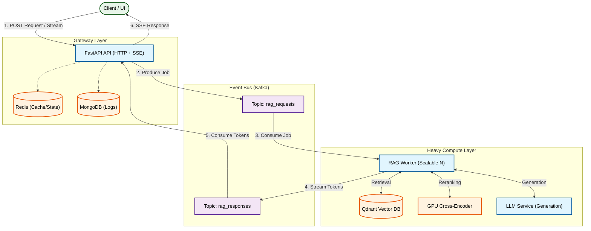

# 🚀 UltimateRAG

**Scalable Streaming RAG System (Kafka + SSE + Qdrant)**

UltimateRAG is a **production-oriented Retrieval-Augmented Generation (RAG) playground** designed to be **edited, tuned, and scaled** for real-world use cases.

It focuses on:

- large documents  
- high concurrency  
- real-time streaming responses  
- clean separation between API and heavy AI workloads  

This is **not a demo** or a notebook-based prototype.

---

## 🧠 What Is This System?

Think of UltimateRAG as a **factory-style AI backend**:

- The **API never blocks**
- All heavy work happens in **background workers**
- Kafka distributes load
- Answers stream **token-by-token** to the client

### Core Components

- **FastAPI** – HTTP + SSE streaming  
- **Kafka** – job queue & horizontal scaling  
- **Qdrant** – hybrid vector search (dense + sparse)  
- **MongoDB** – request logging & traceability  
- **Redis** – idempotency, upload state management & caching  
- **GPU Cross-Encoder** – high-precision reranking  
- **Docker Compose** – local & production-like setup  

---

## 🏗 High-Level Architecture

The system decouples the **Client-facing API** from the **GPU-heavy Workers** using Kafka.



---

## 🔄 Document Upload Flow (RAG Ingestion)

Uploading a document triggers a **full RAG ingestion pipeline**.

1. **API**
* validates request
* logs metadata
* sends upload job to Kafka
* returns immediately (`queued`)


2. **Worker**
* downloads the document
* builds a **document profile** (topic, intent, style)
* splits text into overlapping chunks
* creates **dense + sparse embeddings**
* stores vectors in Qdrant


After this, the document is **fully queryable**.

---

## 💬 Query Flow (Streaming RAG)

Each query runs through multiple quality-improving stages:

1. **Query rewrite**
* uses conversation history (optional)
* converts vague questions into retrieval-friendly queries


2. **Retrieval**
* hybrid dense + sparse search
* high recall (`RAG_TOP_K`)


3. **Reranking**
* GPU cross-encoder
* removes irrelevant chunks
* keeps only the best context


4. **Answer generation**
* LLM generates tokens
* streamed in real time via SSE


If context is insufficient:

* the system retries once
* then safely returns `insufficient context`

---

## 🧠 Why This Design Works

| Problem | Traditional | UltimateRAG |
| --- | --- | --- |
| Long LLM latency | API blocks | Kafka decoupling |
| High concurrency | Thread limits | Partition-based scaling |
| Streaming | Hard to manage | SSE + dispatcher |
| Large documents | Memory-heavy | Chunked ingestion |
| Scaling | Vertical only | Horizontal workers |

---

## ⚙️ Requirements

* Docker & Docker Compose
* NVIDIA GPU + **nvidia-container-toolkit** (for fast reranking)
* OpenAI API key

> Without GPU, the system still works but reranking runs on CPU (much slower).

---

## 🔐 Environment Variables

Create a `.env` file in the root directory:

```env
OPENAI_API_KEY=your_key_here
APP_ENV=dev
LOG_LEVEL=INFO

```

---

## ▶️ Run the System

```bash
docker compose build --no-cache
docker compose up -d

```

Check status:

```bash
docker compose ps

```

---

## 🧪 Test Scenarios

### 1️⃣ Upload a Document

Example: **Ulysses (Project Gutenberg)**

```bash
curl -X POST "http://localhost:8000/rag/documents/ulysses/upload?source_url=https%3A%2F%2Fwww.gutenberg.org%2Fcache%2Fepub%2F4300%2Fpg4300.txt&filename=ulysses.txt&user_id=test-user-1"

```

---

### 2️⃣ Ask a Question (Streaming)

```bash
curl -N "http://localhost:8000/rag/stream/ulysses?prompt=Who%20is%20Leopold%20Bloom%3F&session_id=stream-test-1&user_id=test-user-1"

```

---

### 3️⃣ Conversation History

```bash
curl -N "http://localhost:8000/rag/stream/ulysses?prompt=Why%20did%20you%20think%20that&session_id=stream-test-1&user_id=test-user-1"

```

---

### 4️⃣ Delete a Document

```bash
curl -X DELETE "http://localhost:8000/rag/documents/ulysses/delete?user_id=test-user-1"

```

---

## 📈 Scaling Workers

To handle higher load, scale the workers horizontally:

```bash
docker compose up -d --scale rag-worker=4

```

Kafka automatically rebalances partitions. You can verify the consumer groups:

```bash
docker exec -it kafka kafka-consumer-groups \
  --bootstrap-server kafka:9092 \
  --describe --group rag-worker

```

---

## ⚠️ Important Notes

### GPU Support

* Requires **nvidia-container-toolkit**
* Without it, cross-encoder falls back to CPU

### Security & Rate Limiting

Not included by design:

* no auth
* no rate limits
* no TLS
* no quotas

➡️ **Do not expose directly to the public internet.**
Use an API gateway + auth layer in real deployments.

---

### Consider Utilization (Recommended Production Pattern)

In production, the **most robust and scalable pattern** is to **terminate SSE connections in the backend only**, while treating the AI/RAG layer as a **pure utility worker system**.

**Recommended flow:**

* UI opens **SSE connection only to the backend**
* Backend:
* accepts client request
* publishes job to Kafka
* keeps SSE channel open


* AI/RAG workers:
* consume jobs from Kafka
* perform retrieval, reranking, and generation
* publish incremental results back to Kafka


* Backend:
* consumes AI responses
* forwards tokens/events to the client over SSE


**Why this matters:**

* **AI services never manage network connections** (no SSE state, no client lifecycle awareness)
* **Workers stay stateless and horizontally scalable**
* **Backpressure is centralized** (slow clients do not affect GPU workers)
* **GPU utilization stays high** (workers focus purely on compute)
* **Failure isolation** (SSE disconnects do not kill generation)

> **Backend owns connectivity. Kafka owns flow control. AI workers own computation.**

This architecture is strongly recommended for **high-concurrency, streaming, GPU-backed RAG systems**.

---

## 🎯 Final Notes

UltimateRAG is meant to be:

* a **reference architecture**
* a **learning tool**
* a **production starting point**

If you understand this system, you understand how **modern scalable AI backends** are built.